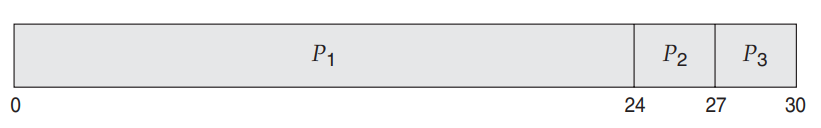
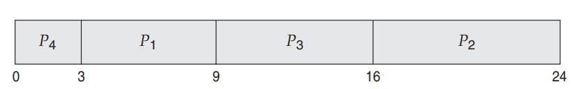
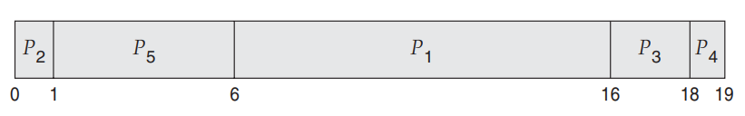
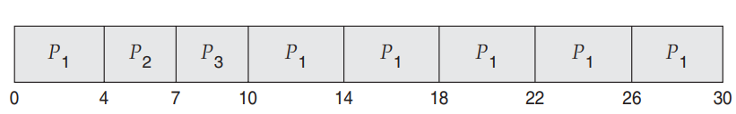

# Operating_System

### The codes are for cpu I/O Burst Cycle:

<ol>
<li>

[FCFS](https://github.com/Jubayer934/Operating_System/blob/main/FCFS.cpp) means  <b>First-Come, First-Served Scheduling</b>
<table border="1">
<tr>
<th>Process</th>
<th>Burst Time</th>
</tr>
<tr>
<td>P1</td>
<td>24</td>
</tr>
<tr>
<td>P2</td>
<td>3</td>
</tr>
<tr>
<td>P3</td>
<td>3</td>
</tr>

By far the simplest CPU-scheduling algorithm is the first-come, first-served
(FCFS) scheduling algorithm. With this scheme, the process that requests the
CPU first is allocated the CPU first. The implementation of the FCFS policy is
easily managed with a FIFO queue. When a process enters the ready queue, its
PCB is linked onto the tail of the queue. When the CPU is free, it is allocated to
the process at the head of the queue. The running process is then removed from
the queue. The code for FCFS scheduling is simple to write and understand.
On the negative side, the average waiting time under the FCFS policy is
often quite long. Consider the following set of processes that arrive at time 0,
with the length of the CPU burst given in milliseconds. If the processes arrive in the order P1, P2, P3, and are served in FCFS order,we get the result shown in the following Gantt chart, which is a bar chart that illustrates a particular schedule, including the start and finish times of each of the participating processes:

The waiting time is 0 milliseconds for process P1, 24 milliseconds for process
P2, and 27 milliseconds for process P3. Thus, the average waiting time is (0
+ 24 + 27)/3 = 17 milliseconds

</table></li>

<li>

[SJF](https://github.com/Jubayer934/Operating_System/blob/main/SJF.cpp) means  <b> Shortest-Job-First Scheduling</b>
<table border="1">
<tr>
<th>Process</th>
<th>Burst Time</th>
</tr>
<tr>
<td>P1</td>
<td>6</td>
</tr>
<tr>
<td>P2</td>
<td>8</td>
</tr>
<tr>
<td>P3</td>
<td>7</td>
</tr>

<tr>
<td>P4</td>
<td>3</td>
</tr>

A different approach to CPU scheduling is the shortest-job-first(SJF) scheduling
algorithm. This algorithm associates with each process the length of the
process’s next CPU burst. When the CPU is available, it is assigned to the process that has the smallest next CPU burst. If the next CPU bursts of two processes are the same, FCFS scheduling is used to break the tie. Note that a more appropriate term for this scheduling method would be the shortest-nextCPU-burst algorithm, because scheduling depends on the length of the next
CPU burst of a process, rather than its total length. We use the term SJF because
most people and textbooks use this term to refer to this type of scheduling.
As an example of SJF scheduling, consider the following set of processes, with the length of the CPU burst given in milliseconds:

The waiting time is 3 milliseconds for process P1, 16 milliseconds for process
P2, 9 milliseconds for process P3, and 0 milliseconds for process P4. Thus, the average waiting time is (3 + 16 + 9 + 0)/4 = 7 milliseconds. By comparison, if we were using the FCFS scheduling scheme, the average waiting time would
be 10.25 milliseconds.

</table></li>

<li>

[Priority](https://github.com/Jubayer934/Operating_System/blob/main/Priority.cpp) means  <b>Priority Scheduling</b>
<table border="1">
<tr>
<th>Process</th>
<th>Burst Time</th>
</tr>
<tr>
<td>P1</td>
<td>24</td>
</tr>
<tr>
<td>P2</td>
<td>3</td>
</tr>
<tr>
<td>P3</td>
<td>3</td>
</tr>

 Discuss scheduling in terms of high priority and low priority.
Priorities are generally indicated by some fixed range of numbers, such as 0
to 7 or 0 to 4,095. However, there is no general agreement on whether 0 is the
highest or lowest priority. Some systems use low numbers to represent low
priority; others use low numbers for high priority. This difference can lead to
confusion. In this text, we assume that low numbers represent high priority.
As an example, consider the following set of processes, assumed to have
arrived at time 0 in the order P1, P2, ···, P5, with the length of the CPU burst
given in milliseconds.

Using priority scheduling, we would schedule these processes according to the
following Gantt chart:

The average waiting time is 8.2 milliseconds.

</table></li>

</table></li>

</table></li>

<li>

[RR](https://github.com/Jubayer934/Operating_System/blob/main/RR.cpp) means  <b>Round-Robin Scheduling</b>
<table border="1">
<tr>
<th>Process</th>
<th>Burst Time</th>
</tr>
<tr>
<td>P1</td>
<td>24</td>
</tr>
<tr>
<td>P2</td>
<td>3</td>
</tr>
<tr>
<td>P3</td>
<td>3</td>
</tr>

If we use a time quantum of 4 milliseconds, then process P1 gets the first 4
milliseconds. Since it requires another 20 milliseconds, it is preempted after
the first time quantum, and the CPU is given to the next process in the queue,
process P2. Process P2 does not need 4 milliseconds, so it quits before its time
quantum expires. The CPU is then given to the next process, process P3. Once
each process has received 1 time quantum, the CPU is returned to process P1
for an additional time quantum. The resulting RR schedule is as follows:

Let’s calculate the average waiting time for this schedule. P1 waits for 6
milliseconds (10 - 4), P2 waits for 4 milliseconds, and P3 waits for 7 milliseconds.
Thus, the average waiting time is 17/3 = 5.66 milliseconds.

</table></li>

# Jubayer-Al-Mahmud